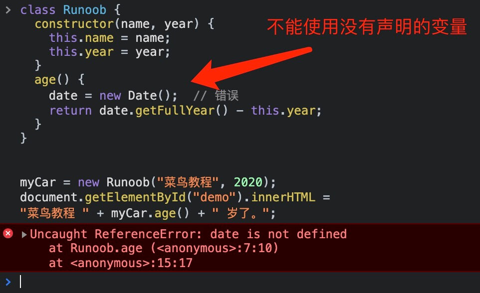
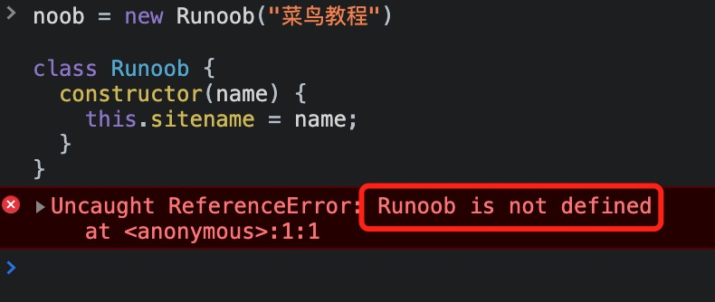
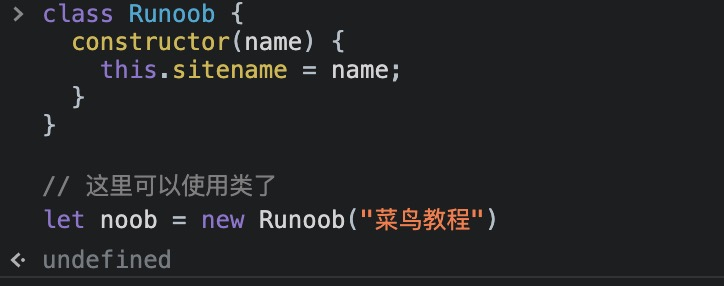
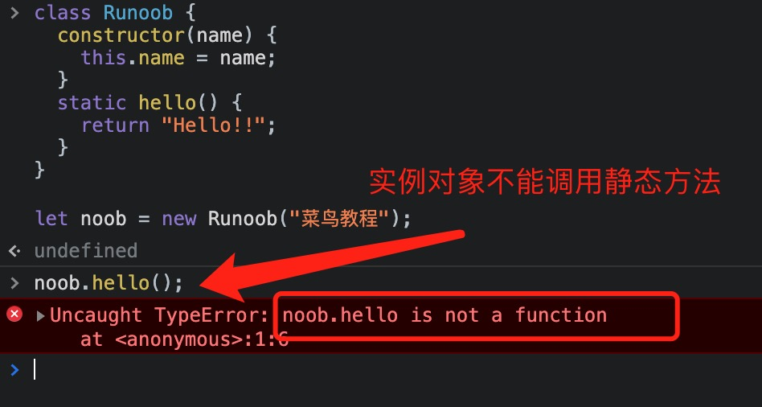

## JavaScript 类(class)

**类是用于创建对象的模版.**

我们使用 class 关键字来创建一个类,类体在一对大括号 {} 中,我们可以在大括号 {} 中定义类成员的位置,如方法或改造函数.

每个类中包含了一个特殊的方法 **constructor()**,它是类的构造函数,这种方法用于创建和初始化一个由 **class** 创建的对象.

创建一个类的语法格式如下:

```
class ClassName {
  constructor() { ... }
}
```

```
class Runoob {
  constructor(name, url) {
    this.name = name;
    this.url = url;
  }
}
```

以上实例创建了一个类,名为 "Runoob".

类中初始化了两个属性: "name" 和 "url".

### 使用类

定义好类后,我们可以使用 **new** 关键字来创建对象:

```
class Runoob {
  constructor(name, url) {
    this.name = name;
    this.url = url;
  }
}
 
let site = new Runoob("菜鸟教程",  "https://www.runoob.com");
```

创建对象时会自动调用构造函数的方法 **constructor()**.

**类表达式**

类表达式是定义类的另一种方法.类表达式可以命名或不命名.命名类表达式的名称是该类体的局部名称.

```
// 未命名/匿名类
let Runoob = class {
  constructor(name, url) {
    this.name = name;
    this.url = url;
  }
};
console.log(Runoob.name);
// output: "Runoob"
 
// 命名类
let Runoob = class Runoob2 {
  constructor(name, url) {
    this.name = name;
    this.url = url;
  }
};
console.log(Runoob.name);
// 输出: "Runoob2"
```

构造方法

构造方法是一种特殊的方法:

- 构造方法名为 constructor()

- 构造方法在创建新对象时会自动执行.

- 构造方法用于初始化对象属性.

- 如果不定义构造方法, JavaScript 会自动添加一个空的构造方法.

### 类的方法

我们使用关键字 **class** 创建一个类,可以添加一个 **constructor()** 方法,然后添加任意数量的方法.

```
class ClassName {
  constructor() { ... }
  method_1() { ... }
  method_2() { ... }
  method_3() { ... }
}
```

以下实例我们创建一个  "age" 方法,用于返回网站年龄:

```
class Runoob {
  constructor(name, year) {
    this.name = name;
    this.year = year;
  }
  age() {
    let date = new Date();
    return date.getFullYear() - this.year;
  }
}
 
let runoob = new Runoob("菜鸟教程", 2018);
document.getElementById("demo").innerHTML =
"菜鸟教程 " + runoob.age() + " 岁了。";
```

我们还可以向类的方法发送参数:

```
class Runoob {
  constructor(name, year) {
    this.name = name;
    this.year = year;
  }
  age(x) {
    return x - this.year;
  }
}
 
let date = new Date();
let year = date.getFullYear();
 
let runoob = new Runoob("菜鸟教程", 2020);
document.getElementById("demo").innerHTML=
"菜鸟教程 " + runoob.age(year) + " 岁了。";
```

### 严格模式 "use strict"

类声明和类表达式的主体都执行在严格模式下.比如,构造函数,静态方法,原型方法,getter 和 setter 都在严格模式下执行.

如果我们没有遵循严格模式,则会出现错误:

```
class Runoob {
  constructor(name, year) {
    this.name = name;
    this.year = year;
  }
  age() {
    // date = new Date();  // 错误
    let date = new Date(); // 正确
    return date.getFullYear() - this.year;
  }
}
```

下图实例使用类未声明的变量:



### 参考

**类方法**

|方法|描述|
|:-|:-|
|constructor()|构造函数,用于创建和初始化类|

**类关键字**

|关键字|描述|
|:-|:-|
|extends|继承一个类|
|static|在类中定义一个静态方法|
|super|调用父类的构造方法|

## JavaScript 类继承

JavaScript 类继承使用 extends 关键字 

继承允许我们依据另一个类来定义一个类,这使得创建和维护一个应用程序变得更容易.

**super()** 方法用于调用父类的构造函数.

当创建一个类时,我们不需要重新编写新的数据成员和成员函数,只需指定新建的类继承了一个已有的类的成员即可.这个已有的类称为 **基类 (父类)**,新建的类称为**派生类 (子类)**.

继承代表了 **is a** 关系.例如,哺乳动物是动物,狗是哺乳动物,因此,狗是动物,等等.


代码如下:

```
// 基类
class Animal {
    // eat() 函数
    // sleep() 函数
};
 
 
//派生类
class Dog extends Animal {
    // bark() 函数
};
```

以下实例创建的类 "Runoob" 继承了 "Site" 类:

```
class Site {
  constructor(name) {
    this.sitename = name;
  }
  present() {
    return '我喜欢' + this.sitename;
  }
}
 
class Runoob extends Site {
  constructor(name, age) {
    super(name);
    this.age = age;
  }
  show() {
    return this.present() + ', 它创建了 ' + this.age + ' 年。';
  }
}
 
let noob = new Runoob("菜鸟教程", 5);
document.getElementById("demo").innerHTML = noob.show();
```

**super()** 方法引用父类的构造方法.

通过在构造方法中调用 **super()** 方法,我们调用了父类的构造方法,这样就可以访问父类的属性和方法.

继承对于代码可复用性很有用.

JavaScript 并没有像其他变成语言一样具有传统的类,而是基于原型的继承模型.

ES6 引入了类和 **class** 关键字,但底层机制仍然基于原型继承.

**使用原型链继承**

在下面实例中,Animal 是一个基类,Dog 是一个继承自 Animal 的子类,Dog.prototype 使用 Object.create(Animal.prototype) 来创建一个新对象,它继承于 Animal.prototype 的方法和属性,通过将 Dog.prototype.constructor 设置为 Dog,确保继承链上的构造函数正确.

```
function Animal(name) {
  this.name = name;
}
 
Animal.prototype.eat = function() {
  console.log(this.name + " is eating.");
};
 
function Dog(name, breed) {
  Animal.call(this, name);
  this.breed = breed;
}
 
// 建立原型链，让 Dog 继承 Animal
Dog.prototype = Object.create(Animal.prototype);
Dog.prototype.constructor = Dog;
 
Dog.prototype.bark = function() {
  console.log(this.name + " is barking.");
};
 
var dog = new Dog("Buddy", "Labrador");
dog.eat();  // 调用从 Animal 继承的方法
dog.bark(); // 调用 Dog 的方法
```

**使用 ES6 类继承**

ES6 引入了 class 关键字,使得定义类和继承更加清晰,extends 关键字用于建立继承关系,super 关键字用于在子类构造函数中调用父类的构造函数.

```
class Animal {
  constructor(name) {
    this.name = name;
  }
 
  eat() {
    console.log(this.name + " is eating.");
  }
}
 
class Dog extends Animal {
  constructor(name, breed) {
    super(name);
    this.breed = breed;
  }
 
  bark() {
    console.log(this.name + " is barking.");
  }
}
 
const dog = new Dog("Buddy", "Labrador");
dog.eat();
dog.bark();
```

不论是使用原型链继承还是 ES6 类继承,都可以实现类似的继承效果,在选择哪种方法时,可以依据个人偏好和项目需求来决定.

### getter 和 setter

类中我们可以使用 getter 和 setter 来获取和设置值,getter 和 setter 都需要在严格模式下执行.

getter 和 setter 可以使得我们对属性的操作变的很灵活.

类中添加 getter 和 setter 使用的是 get 和 set 关键字.

以下实例为 sitename 属性创建 getter 和 setter:

```
class Runoob {
  constructor(name) {
    this.sitename = name;
  }
  get s_name() {
    return this.sitename;
  }
  set s_name(x) {
    this.sitename = x;
  }
}
 
let noob = new Runoob("菜鸟教程");
 
document.getElementById("demo").innerHTML = noob.s_name;
```

**注意:** 即使 getter 是一个方法,当我们想获取属性值时也不要使用括号.

getter/setter 方法和名称不能与属性的名称相同,在本例中属名为 sitename.

很多开发者在属性名称前使用下划线字符 _ 将 getter/setter 与实际属性分开:

以下实例使用下划线 _ 来设置属性,并创建对应的 getter/setter 方法：

```
class Runoob {
  constructor(name) {
    this._sitename = name;
  }
  get sitename() {
    return this._sitename;
  }
  set sitename(x) {
    this._sitename = x;
  }
}
 
let noob = new Runoob("菜鸟教程");
 
document.getElementById("demo").innerHTML = noob.sitename;
```

要使用 setter,请使用与设置属性值时相同的语法,虽然 set 是一个方法,但需要不带 **括号**:

```
class Runoob {
  constructor(name) {
    this._sitename = name;
  }
  set sitename(x) {
    this._sitename = x;
  }
  get sitename() {
    return this._sitename;
  }
}
 
let noob = new Runoob("菜鸟教程");
noob.sitename = "RUNOOB";
document.getElementById("demo").innerHTML = noob.sitename;
```

### 提升

函数声明和类声明之间的一个重要区别在于,函数声明会提升,类声明不会.

我们首先需要声明类,然后再访问它,否则类似以下的代码将抛出 ReferenceError:

```
// 这里不能这样使用类，因为还没有声明
// noob = new Runoob("菜鸟教程")
// 报错
 
class Runoob {
  constructor(name) {
    this.sitename = name;
  }
}
 
// 这里可以使用类了
let noob = new Runoob("菜鸟教程")
```

使用前没有声明会报错:



使用前已经声明可以正常执行:



## JavaScript 静态方法

静态方法是使用 static 关键字修饰的方法,又叫类方法,属于类的,但不属于对象,在实例化对象之前可以通过 **类名.方法名** 调用静态方法.

静态方法不能在对象上调用,只能在类中调用.

```
class Runoob {
  constructor(name) {
    this.name = name;
  }
  static hello() {
    return "Hello!!";
  }
}
 
let noob = new Runoob("菜鸟教程");
 
// 可以在类中调用 'hello()' 方法
document.getElementById("demo").innerHTML = Runoob.hello();
 
// 不能通过实例化后的对象调用静态方法
// document.getElementById("demo").innerHTML = noob.hello();
// 以上代码会报错
```

实例对象调用静态方法会报错:



如果想在对象 noob 中使用静态方法,可以作为一个参数传递给它:

```
class Runoob {
  constructor(name) {
    this.name = name;
  }
  static hello(x) {
    return "Hello " + x.name;
  }
}
let noob = new Runoob("菜鸟教程");
document.getElementById("demo").innerHTML = Runoob.hello(noob);
```


